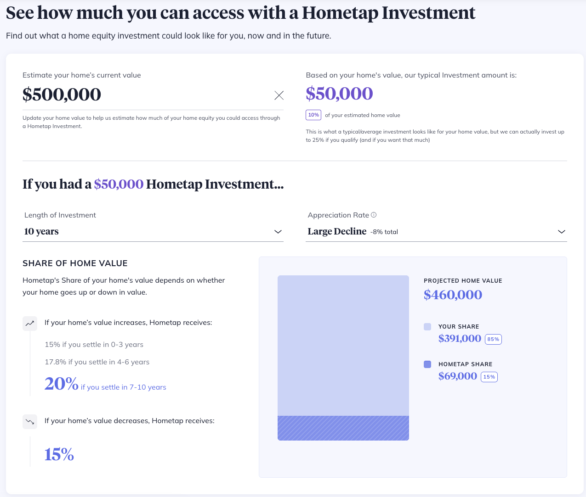

# HomeTap Cap Analysis

## L1 — What this is

Most PMs optimize UX or growth without fully understanding the underlying economic and customer dynamics—leading to well-executed products that fail to impact outcomes.

This project focuses on understanding the **economic engine** behind HomeTap’s product—where one decision becomes clear:

→ Growth without geographic discipline can turn a high-return product into a low-return asset.

👉 **[View the report](https://joemcao.github.io/hometap/calculator-report.html)** (charts, tables, and methodology)

### Repository layout

| Path | Purpose |
|------|---------|
| [`scripts/`](./scripts/) | Extractors and report builder (`npm run extract`, `extract:all`, `report`, etc.) |
| [`data/`](./data/) | Snapshot `calculator-responses.json` and generated `calculator-table.csv` |
| [`calculator-report.html`](./calculator-report.html) | Generated HTML report (kept at repo root for GitHub Pages) |
| [`assets/`](./assets/) | Images referenced by this README (add files here as needed) |

After cloning: `npm install` → optional `npm run extract:all` to refresh data → `npm run report` to regenerate the HTML and CSV.

---

## Product context

Below is the HomeTap calculator used as the basis for this analysis:

**Source:** HomeTap public calculator  
**URL:** https://www.hometap.com/how-it-works?home_value=500000#how-it-works-calculator  
**Data extracted:** February 21, 2026  
**Analysis published:** April 16, 2026

---

## L2 — Key insights

### 1. Returns are front-loaded and decay over time
IRR peaks early (~20% at year 1–2 across scenarios) and then declines steadily as time increases.

→ The product generates the highest returns on short holding periods, not long ones.

---

### 2. Downside scenarios collapse to near risk-free returns
In large and moderate decline scenarios, IRR drops to ~3–5% by year 10.

→ Returns in downside cases are barely above (or below) risk-free rates, despite taking equity risk.

---

### 3. Appreciation drives long-term viability
In appreciation scenarios, IRR remains meaningfully higher (~11–16% by year 10), while flat/declining markets converge toward low single digits.

→ The product is fundamentally a leveraged bet on home price appreciation.

---

### 4. Timing matters more than percentage share
Even when Hometap’s share % stabilizes, IRR continues to decline over time.

→ Time decay dominates the economics, not just payout structure.

---

### 5. Product creates asymmetric outcomes across scenarios
- High appreciation → sustained double-digit returns  
- No change → mid-single digit returns  
- Decline → low single digit returns  

→ The same product behaves like different asset classes depending on market conditions.

---

### 6. Downside scenarios create strategic optionality for the homeowner
In declining price scenarios, the homeowner’s obligation is based on a reduced home value.

→ This creates a potential incentive to settle during downturns, depending on contract terms and future price expectations.

→ The product embeds a form of **market-timing optionality** for the homeowner.

---

### 7. The product behaves like a time-dependent equity option
HomeTap’s payoff structure resembles an embedded option on home value, where:

- The homeowner exchanges a portion of future appreciation  
- The effective “strike” and “share” depend on timing and price path  
- Outcomes vary significantly based on when settlement occurs  

→ This creates a path-dependent payoff structure, similar to an option with time-varying terms.

Importantly:
- The homeowner does not transfer a fixed ownership stake upfront  
- The effective share of value is determined at settlement based on contract terms  

→ The product is better understood as a **contract on future value**, not static equity ownership.

---

## L3 — Product implications

This analysis highlights a core principle for financial products:

> Product decisions must be grounded in a deep understanding of the underlying economic model — not just user growth or UX.

### 1. User behavior directly impacts returns
Investor outcomes vary significantly based on when the homeowner exits.

→ Product design (UX, messaging, incentives) directly shapes user behavior—and therefore realized returns.

→ Even small changes in how information is presented (e.g., amount owed vs. share of appreciation) can shift user decisions, turning UX into a financial lever, not just a usability concern.

---

### 2. Time and market conditions are primary drivers
Returns are highly sensitive to:
- Holding period (IRR decay over time)
- Home price appreciation

→ Product performance is driven as much by **where and when** capital is deployed as by user behavior.

→ Growth is not just acquiring users—it is allocating capital across markets with different return profiles.

→ In practice, this turns expansion into a **portfolio construction problem**, not just a distribution strategy.

---

### 3. Misaligned intuition creates bad product decisions
Without understanding the economic engine, teams may:
- Optimize for engagement over outcomes  
- Build features that unintentionally reduce returns  
- Misinterpret performance signals  

→ Deep product understanding is required to avoid “shiny but harmful” improvements.

---

### 4. Early-stage products carry hidden uncertainty
HomeTap has limited long-term realized outcomes (products <10 years old).

→ Modeled returns may differ from realized performance as cohorts mature.

### 5. Communication and regulatory considerations

Financial products like this sit at the intersection of economics, user behavior, and regulation.

→ How outcomes are communicated (e.g., appreciation scenarios, downside cases) can materially affect user understanding and decision-making.

→ Misalignment between product economics and user perception introduces potential risks around transparency and consumer protection.

Additionally, geographic expansion introduces regulatory complexity:

→ Different markets may have varying fair lending and consumer protection considerations  
→ Product performance and regulatory exposure may evolve differently across geographies  

→ Product, growth, and compliance cannot be separated—they must be designed as a unified system.

---

### Takeaway

Strong product management in financial systems requires:
- Understanding how value is created  
- Knowing what variables actually drive outcomes  
- Designing experiences that align user behavior with sustainable economics  

This is not a UI problem — it’s a system design problem.

---

## What I did

- Extracted calculator outputs across 10-year horizons and 5 market scenarios  
- Modeled HomeTap’s share evolution (dollars and %)  
- Estimated investor IRR across scenarios  
- Built an interactive report for exploration  

---

## Why this matters

Most PMs focus on growth and UX.

This project demonstrates the ability to:
- Break down financial products into economic drivers  
- Connect user behavior to business outcomes  
- Make decisions under uncertainty  

## Scope and limitations

This analysis is based on publicly available calculator outputs and simplified assumptions.

It focuses on directional behavior across time and market scenarios—not precise replication of HomeTap’s internal performance.

The goal is to understand the **structure of the product**, not to produce exact forecasts.